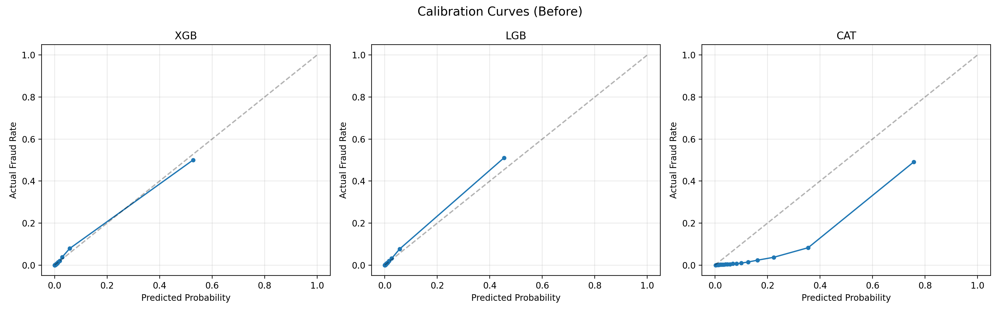
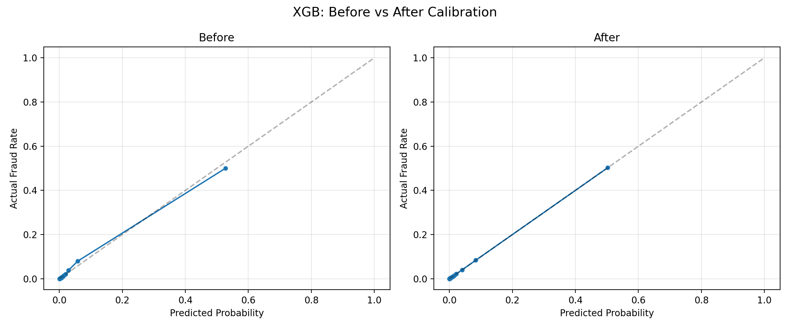
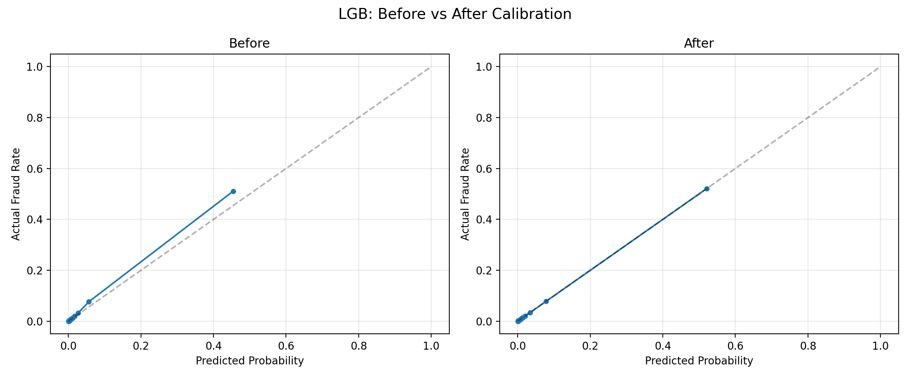
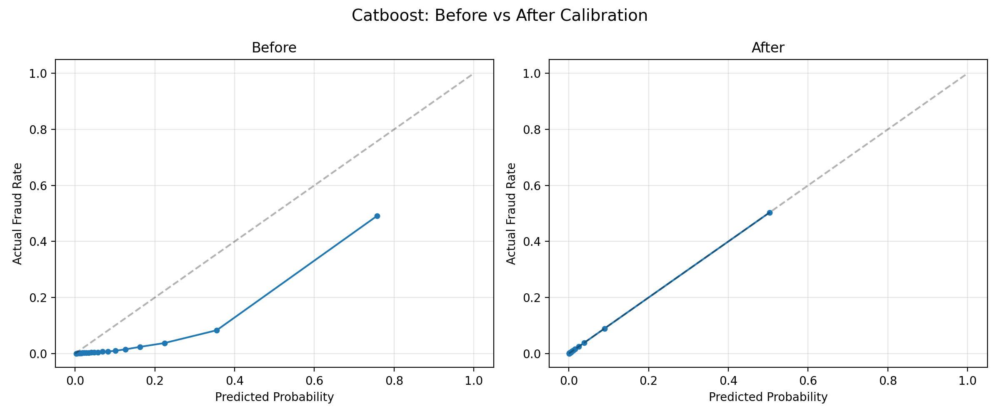
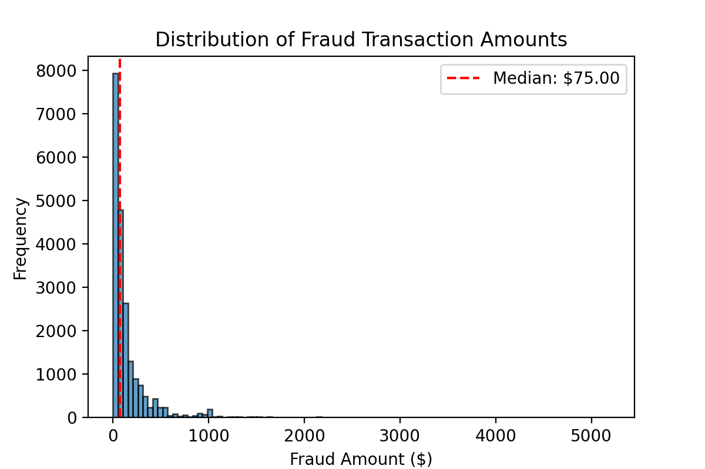
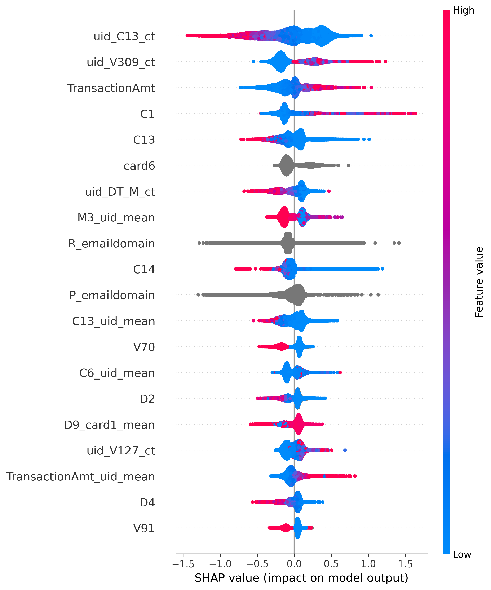

# Cost-Optimized Fraud Detection System

## Summary
This project builds a cost-optimized fraud detection ensemble on top of EDA and feature engineering adapted from the 
IEEE-CIS Fraud Detection competition winners. The original contributions include:
- Trained three gradient boosted models (XGBoost, LightGBM, CatBoost) using stratified 6-fold cross-validation
- Identified and corrected probability calibration issues across models using isotonic regression, revealing systematic overconfidence in CatBoost's predictions
- Formulated ensemble construction as an explicit cost minimization problem with a 6:1 false negative to false positive cost ratio
- Used Bayesian black-box optimization (Optuna) to jointly optimize ensemble weights and decision threshold, reducing business cost by approximately $9,225 (1%) over the equal-weight baseline and $22K–$102K over individual models
- Validated feature engineering through weighted ensemble SHAP analysis, confirming that UID-based client identification features dominated predictions

## Contents

- [Problem Statement](#problem-statement) 
- [Dataset Overview](#dataset-overview) 
  - [Brief Summary Of Features](#brief-summary-of-features)
- [EDA and Feature Engineering](#eda-feature-engineering)
- [Model Training](#model-training)
- [Model Calibration](#model-calibration)
- [Ensemble Cost Optimization](#ensemble-cost-optimization)
  - [Determining Cost Coefficients](#determining-cost-coefficients)
  - [Determining Ensemble Weights](#determining-ensemble-weights)
  - [Optimization Constraints](#optimization-constraints)
- [Results and Evaluation](#results-and-evaluation)
  - [Baseline](#baseline)
  - [Optimization and Results](#optimization-and-results)
  - [Model Interpretability](#model-interpretability)
- [Conclusion](#conclusion)

## Problem Statement
Traditional fraud detection models optimize for AUC, treating all prediction errors equally. In practice this may not 
necessarily be the case. In fraud detection false negatives (missed fraud) are much more damaging than false positives 
(incorrect flagging of fraud) to a business. This project aims to tackle the problem of balancing overall prediction
accuracy and business cost. 

## Dataset Overview
The IEEE-CIS dataset comprises 590540 e-commerce transactions spanning six months with 3.5% fraud prevalence. Features 
include transaction metadata (amount, product, timing), card/payment identifiers, and device fingerprints, totaling 400+
dimensions with extensive anonymization. Key characteristics include severe class imbalance (1:27 ratio), temporal 
structure requiring time-aware validation, and missing data rates from 0.1-90% across features. 
The dataset exhibits temporal non-stationarity as fraud patterns evolve across the observation 
period.

### Brief Summary of Features
The following list is a summary of the features given by the dataset, note the descriptions are adapted from this 
[kaggle discussion](https://www.kaggle.com/competitions/ieee-fraud-detection/discussion/101203).
- TransactionDT: timedelta from a given reference datetime (not an actual timestamp)
- TransactionAMT: transaction payment amount in USD. Note some transactions are possibly converted to USD given that they have more than 2 decimals.
- ProductCD: product or service code.
- card1 - card6: payment card information, such as card type, card category, bank, country, etc.
- addr: Address associated with the card.
- dist: distance between billing address and mailing address.
- P_ and (R_) emaildomain: purchaser and recipient email domain.
- C1-C14: Addresses, such as how many addresses are found to be associated with the payment card, ip adress, etc.
- D1-D15: timedelta, such as days between previous transaction, etc.
- M1-M9: match, such as names on card and address, etc.
- V1-V339: Vesta engineered rich features, including ranking, counting, and other entity relations. Note these are all numerical as opposed to categorical.

In total there are 393 features in the original dataset.

## EDA, Feature Engineering
The exploratory data analysis and feature engineering in this project are adapted from the winners
[Chris Deotte and Konstantin Yakovlev](https://www.kaggle.com/competitions/ieee-fraud-detection/writeups/fraudsquad-1st-place-solution-part-2)
of the original competition. Rather than re-inventing this groundwork, the focus of this project is on what happens 
after feature engineering: comparing model architectures, identifying and correcting probability calibration issues, 
and building a cost-optimized ensemble. The modeling, calibration, and ensemble optimization sections represent 
original work.

The original feature space contained over 400 columns, including a large number of anonymized V-features. These were 
reduced by grouping columns with similar NaN structure, applying PCA to each group, and selecting uncorrelated subsets. 
Feature selection was then performed using forward selection, recursive elimination, permutation importance, adversarial 
validation, correlation analysis, time consistency, client consistency, and train/test distribution analysis. Features 
were engineered using frequency encoding, label encoding, group aggregation, feature combination, and nunique 
aggregation.

The key added feature was a unique identification (UID) to approximate individual client identities. Since the dataset 
contained no explicit client identifier, UIDs were constructed by combining card and address information with a derived 
reference date that remained constant across a client's transactions. This enabled a large set of group aggregation 
features capturing client-level behavior, such as average transaction amount per client or the number of distinct email 
domains used. These UID-based features ultimately dominated the ensemble's SHAP importance rankings.

For detailed descriptions of each technique, see the 
[supplementary methodology document](eda_feature_engineering.md).

# Model Training
Three gradient boosted tree models were trained, namely XGBoost, LightGBM, and CatBoost. All three are boosting algorithms but 
differ in their tree construction and gradient estimation strategies, which leads to each model learning slightly 
different patterns from the same data. This architectural diversity is what makes them good ensemble candidates. Also, 
gradient boosted methods typically perform well on tabular data with mixed features. Each model was trained using 
stratified 6-fold cross-validation to produce out-of-fold predictions, which serve as the 
basis for all subsequent model comparison, calibration, and ensemble optimization. For brevity, the averaged predictions
across all folds of each method will be referred to as a single model (e.g., 'XGB'). The ensemble combines predictions across the three methods rather than across individual folds.
Default hyperparameters were used for all three models. The focus of this project is on the ensemble optimization 
framework rather than maximizing individual model performance. In practice, hyperparameter tuning would be an additional
layer of improvement on top of the ensemble approach.

The training notebooks can be found in the notebooks folder.

# Model Comparison

With three trained models, the next step is understanding how each performs individually before combining them. 
In fraud detection, the key tradeoff is between catching fraud (recall) and minimizing false alarms (precision). 
The relative cost of missing a fraud (false negative) versus investigating a false alarm (false positive) determines 
where this tradeoff should land, which motivates the cost sensitive optimization explored later.

The following tables show model statistics at various thresholds.

**Model Statistics with probability threshold set to 0.5**

| Model | Recall | Precision |  FPR   |   FN   |    FP    |   TP   |  
|:-----:|:------:|:---------:|:------:|:------:|:--------:|:------:|
|  xgb  | 52.62% |   82.36%  | 0.409% |  9,791 |  2,329   | 10,872 |   
|  lgb  | 48.90% |   88.43%  | 0.232% | 10,558 |  1,322   | 10,105 |    
|  cat  | 69.06% |   51.17%  | 2.389% |  6,394 |  13,616  | 14,269 |   
 
**Model Statistics with probability threshold set to 0.2**

| Model | Recall | Precision |    FPR   |   FN  |   FP   |   TP   | 
|:-----:|:------:|:---------:|:--------:|:-----:|:------:|:------:|
|  xgb  | 63.14% |   66.21%  |  1.1685% | 7,617 |  6,659 | 13,046 |    
|  lgb  | 63.44% |   69.49%  |  1.0100% | 7,554 |  5,756 | 13,109 |    
|  cat  | 86.43% |   21.66%  | 11.3379% | 2,803 | 64,612 | 17,860 |    

The above shows that 

- XGB offers balanced performance with 53% recall, 82% precision, and a very low FPR (0.4%)
- LGB is the most conservative, flagging fewer transactions but achieving the highest precision (88%) at the cost of the lowest recall (49%)
- CatBoost catches the most fraud (69% recall) but flags far more legitimate transactions, with a FPR 6x higher than XGB

The 0.2 threshold continues this trend. CatBoost's disproportionately high false positive rate suggests its predicted probabilities operate on a different scale rather than the model genuinely detecting different fraud patterns. Calibrating all three models to a common probability scale will enable a fair comparison and simplify the downstream weight optimization.

# Model Calibration

The following shows the calibration curves for each model. A well calibrated model should follow the diagonal, meaning 
that when the model predicts a 40% chance of fraud, roughly 40% of those transactions should actually be fraudulent. 
The plots show that XGB and LGB generally follow this pattern. However, CatBoost's curve falls below the diagonal across most of the range, indicating overconfidence. When CatBoost predicts a high probability of fraud, the actual fraud rate is considerably lower. This explains the behavior observed earlier where CatBoost flagged significantly more transactions as fraud at the same threshold, producing higher recall but a disproportionately higher false positive rate.

Isotonic regression was used to calibrate all three models. It learns a monotonic mapping from each model's raw scores 
to actual fraud probabilities, so that a calibrated score of 0.3 genuinely corresponds to a 30% fraud rate. 
Isotonic regression was chosen over alternatives like Platt scaling because it makes no assumptions about the shape of 
the miscalibration. While CatBoost showed the most severe miscalibration, all three models were calibrated to ensure 
their probability scales are directly comparable before blending. Importantly, calibration preserves each model's AUC 
since the mapping is monotonic, meaning no discriminative signal is lost. The plot below shows the difference in predicted probabilities before and after calibration.

The following table shows the statistics of the calibrated models.

**Model Statistics with probability threshold set to 0.5**

| Model | Recall | Precision |   FPR   |   FN  |   FP  |  TP   |
|:-----:|:------:|:---------:|:-------:|:-----:|:-----:|:-----:|
|  xgb  | 51.74% |   83.31%  | 0.3757% | 7,978 | 1,713 | 8,552 |
|  lgb  | 51.04% |   86.34%  | 0.2928% | 8,093 | 1,335 | 8,437 |
|  cat  | 47.82% |   83.00%  | 0.3551% | 8,626 | 1,619 | 7,904 |
Unique Catches at threshold 0.5:

- xgb: 350 transactions, total fraud dollars \$53,826, avg fraud \$ caught: \$153.79
- lgb: 478 transactions, total fraud dollars \$101,258, avg fraud \$ caught: \$211.84
- cat: 347 transactions, total fraud dollars \$56,713, avg fraud \$ caught: \$163.44

**Model Statistics with probability threshold set to 0.2**

| Model | Recall | Precision |   FPR   |   FN  |   FP  |   TP   |
|:-----:|:------:|:---------:|:-------:|:-----:|:-----:|:------:|
|  xgb  | 67.10% |   58.66%  | 1.7146% | 5,439 | 7,817 | 11,091 | 
|  lgb  | 66.67% |   63.64%  | 1.3810% | 5,510 | 6,296 | 11,020 | 
|  cat  | 65.08% |   58.55%  | 1.6705% | 5,772 | 7,616 | 10,758 | 

Unique Catches at threshold 0.2:

  - xgb: 350 transactions, total fraud dollars \$43,717, avg fraud \$ caught: \$124.91
  - lgb: 462 transactions, total fraud dollars \$107,078, avg fraud \$ caught: \$231.77
  - cat: 270 transactions, total fraud dollars \$27,619, avg fraud \$ caught: $102.29

The above results show that calibration brought CatBoost's false positive rate in line with the other two models, 
enabling fairer comparisons at a shared threshold. The unique catches analysis reveals that each model still identifies hundreds of fraud cases the others miss, with this disagreement remaining consistent across thresholds. This confirms genuine diversity in what the models detect rather than a threshold artifact, which justifies ensembling. LGB's unique catches are notably the most valuable in dollar terms, consistently worth 2–3x more than those of XGB or CatBoost.

# Ensemble Cost Optimization
Given the analysis of the three models, the goal is to create an ensemble that combines their predictions to minimize business cost. After calibration, all three models show comparable overall performance but each uniquely identifies fraud cases the others miss. The question is how to weight each model's contribution to best exploit this diversity.

The optimization problem can be succinctly phrased by the following objective function:

$$\text{minimize}_{w, \tau} \quad \mathcal{L}(w, \tau) = \text{FN}(w, \tau) \times C_{FN} + \text{FP}(w, \tau) \times C_{FP}$$

Where:
- $w = [w_{XGB}, w_{LGB}, w_{CAT}]$ are the ensemble weights
- $\tau$ is the decision threshold
- $\text{FN}(w, \tau)$ = count of false negatives given weights and threshold
- $\text{FP}(w, \tau)$ = count of false positives given weights and threshold
- $C_{FN}$ and $C_{FP}$ are cost coefficients

The actual variables for the optimization problem are $w$ and $\tau$ which makes this a 4D problem. 

The following section goes through each part of the optimization problem.

## Determining Cost Coefficients
The cost coefficients determine the relative penalty for missing a fraud versus incorrectly flagging a legitimate transaction. To arrive at sensible values, the distribution of fraud transaction amounts can be analyzed to estimate the typical cost of a missed fraud.

The following are some fraud transaction statistics
- Mean = 149.24
- 25th Percentile = 35.04
- Median = 75.00
- 75th Percentile = 161.00

The following plot shows the distribution.

From the analysis the median is 75. However the plot shows that the transaction amounts are heavily skewed to the right 
with the 75th percentile being 161.00 with a mean of 149.24. To be conservative the mean cost will be used ($150).

As for the false positive coefficient, the cost for each false positive corresponds to the price the business pays when 
a business flags a valid transaction as fraud. This has little to no relation with the transaction cost and has much 
more to do with business costs such as customer friction or review time/resources. Therefore, one possible way to 
determine this coefficient is to assume a cost ratio between the false negative and false positive.

For the sake of this project a 6:1 ratio will be used. Therefore the coefficients are $C_{FN} = 150$ and $C_{FP} = 25$. 
In practice, these coefficients would ideally be determined in collaboration with business stakeholders, and a 
sensitivity analysis across a range of cost ratios would be recommended to understand how the optimal weights and 
threshold shift under different assumptions.

## Determining Ensemble Weights

The ensemble probability is computed as a weighted average:

$$ P_{ensemble}(x) = w_{XGB} \cdot P_{XGB}(x) + w_{LGB} \cdot P_{LGB}(x) + w_{CAT} \cdot P_{CAT}(x)$$

Binary prediction is made by thresholding:

$$\hat{y}(x) = \mathbb{1}[P_{ensemble}(x) \geq \tau]$$

Where $\mathbb{1}[\cdot]$ is the indicator function (1 if true, 0 if false) and $\tau$ is the decision boundary.

False negatives and false positives are computed by comparing predictions to true labels across all $N$ transactions:

$$\begin{align}
\text{FN}(w, \tau) &= \sum_{i=1}^{N} \mathbb{1}[y_i = 1 \text{ and } \hat{y}_i(w, \tau) = 0] \quad \text{(actual fraud predicted as legitimate)} \\
\text{FP}(w, \tau) &= \sum_{i=1}^{N} \mathbb{1}[y_i = 0 \text{ and } \hat{y}_i(w, \tau) = 1] \quad \text{(actual legitimate predicted as fraud)}
\end{align}$$

Along with the Cost Coefficients the loss function can be given by:
$$\mathcal{L}(w, \tau) = \text{FN}(w, \tau) \times C_{FN} + \text{FP}(w, \tau) \times C_{FP}$$

[//]: # (#### Concrete Example of Why Weight Selection Matters)

[//]: # (Consider a specific fraud case in which LGB Catches but XGB and Catboost miss.)

[//]: # ()
[//]: # (Example Transaction #37127:)

[//]: # (- True label: Fraud)

[//]: # (- Amount: \$171.00)

[//]: # ()
[//]: # (Individual Model Predictions:)

[//]: # (- P_XGB:  0.159)

[//]: # (- P_LGB:  0.804)

[//]: # (- P_CAT:  0.465)

[//]: # ()
[//]: # (If equal weighting is used the probability is 0.471)

## Optimization Constraints
The objective function also have the following constraints

$$\begin{align}
w_{XGB} + w_{LGB} + w_{CAT} &= 1 \quad \text{(weights sum to 1)} \\
w_{XGB}, w_{LGB}, w_{CAT} &\geq 0 \quad \text{(non-negative weights)} \\
\frac{\text{TP}(w, \tau)}{\text{TP}(w, \tau) + \text{FN}(w, \tau)} &\geq m_{recall} 
\end{align}$$

$m_{recall}$ is the minimum recall percentage. This ensures valid ensemble and maintains minimum fraud detection performance.

# Results and Evaluation
## Baseline
As a baseline, a simple grid search was used to find the optimal threshold for each individual model and for an 
equal-weight ensemble that averaged all three models' predicted probabilities. These baselines are included in the final comparison table below.
Relative to the model comparison section, the false positive rate is much higher due to the cost coefficients assigned 
to the false negatives and false positives in the optimization function.

## Optimization and Results
Since the above optimization problem is discrete (and therefore non-differentiable), black-box optimization was used. 
To recap the parameters of the optimization problem are the ensemble weights ($w_{XGB}, w_{LGB}, w_{CAT}$) and the 
threshold $\tau$. The Optuna package was used, which implements a Bayesian approach that models separate density estimators 
for promising and unpromising regions of the hyperparameter space to guide the search (the Tree-Structured Parzen 
Estimator). The results are shown below.

|    Model     | Threshold | Recall (%) | Precision (%) |  FN   |  FP   | FPR (%)   | Cost ($)  |
|:------------:|:---------:|:----------:|:-------------:|:-----:|:-----:|:---------:|:---------:|
|     XGB      |   0.126   |   71.32    |     50.46     | 4740  | 11577 |   2.54    | 1,000,425 |
|     LGB      |   0.126   |   72.49    |     52.12     | 4547  | 11010 |   2.41    |  957,300  |
|     CAT      |   0.138   |   70.36    |     49.11     | 4900  | 12053 |   2.64    | 1,036,325 |
| Equal Weight |   0.148   |   71.97    |     54.40     | 4633  | 9973  |   2.19    |  944,275  |
|  Optimized   |   0.137   |   73.20    |     52.79     | 4430  | 10820 |   2.37    |  935,050  |

The following table show the optimized weights found by optuna of the ensemble model.

| Model |   Weight    |
|:-----:|:-----------:|
|  XGB  |   0.1772    |
|  LGB  |   0.6391    |
|  CAT  |   0.1838    |

The optimized ensemble reduced total cost by approximately $9225 (1% relative to the equal-weight baseline), 
primarily by improving recall from 71.97% to 73.20% while accepting a slight increase in false positives. The LGB model 
had the highest weight which is understandable since it originally had the lowest individual cost. 

## Model Interpretability
The benefit of using a weighted ensemble is that interpretability is preserved. SHAP values were computed on the raw 
(pre-calibration) model outputs for each fold using TreeSHAP for XGBoost and LightGBM, and approximate SHAP for 
CatBoost, with 8,000 observations sampled per fold for computational efficiency. Since isotonic regression applies a 
monotonic transformation, feature importance rankings and directional effects are preserved, though the exact magnitudes
reflect the pre-calibration scale. The SHAP values were then concatenated across folds and combined using the optimized
ensemble weights. Since the ensemble prediction is a weighted sum of individual model predictions, this linear 
combination of SHAP values is theoretically valid and produces a single set of feature importances that reflects each 
feature's contribution to the final ensemble prediction.

The SHAP summary plot reveals several notable patterns in the ensemble's predictions. Many features were anonymized for 
the competition, but based on available descriptions, C-columns relate to addresses (e.g., addresses associated with a 
card, IP addresses, etc), M-columns to matching (e.g., name and address matches), D-columns to timedeltas, and 
V-columns are engineered features with no public description.

UID-based features dominate the top rankings, with 'uid_C13_ct' (the count of unique values of an address-related counting
feature per client) and 'uid_V309_ct' (the count of unique values of an anonymized engineered feature per client) ranking 
as the two most important. Both show low values strongly pushing predictions toward not-fraud, which aligns with the 
intuition that clients with consistent, low-diversity behavior appear legitimate. Several other UID-based features also 
appear in the top 20, including 'M3_uid_mean', 'C13_uid_mean', and 'TransactionAmt_uid_mean', confirming that the effort 
invested in client identification during feature engineering was well justified.

Raw features such as 'C1', 'C13', and 'TransactionAmt' show clear directional relationships, with higher values associated 
with fraud predictions. The engineered aggregation features alongside them confirm that group-level encodings captured 
meaningful patterns beyond the raw features. Categorical features such as 'card6', 'R_emaildomain', and 'P_emaildomain' appear
gray since their label-encoded values have no meaningful numeric scale, though their spread indicates they contribute to
predictions. A few features such as 'C14' and 'D4' show mixed color patterns on both sides of zero, suggesting non-linear 
relationships or interaction effects with other features.

# Conclusion

This project demonstrated a cost-optimized approach to fraud detection ensembling. Starting from a strong EDA and 
feature engineering foundation adapted from the competition winners, three gradient boosted models were trained and 
calibrated to a common probability scale using isotonic regression. Calibration was a critical step, as it revealed that
CatBoost's raw probabilities were systematically overconfident and brought all three models into a comparable range for 
fair blending.

The core contribution was framing ensemble construction as an explicit cost minimization problem. By jointly optimizing 
the ensemble weights and decision threshold using Bayesian black-box optimization, the system reduced total cost by 
approximately $9,225 relative to an equal-weight baseline. While the relative improvement was modest at 1%, the 
framework itself is the key result: it provides a principled, repeatable way to translate business cost assumptions into
model decisions rather than relying on threshold selection by intuition.

The SHAP analysis confirmed that UID-based features dominated the ensemble's predictions, validating the importance of 
client identification in fraud detection. The interpretability of the weighted ensemble approach meant that feature 
contributions could be traced through the full pipeline from individual models to the final prediction.

In practice, further improvements could come from hyperparameter tuning of the individual models, exploring additional 
model architectures to increase ensemble diversity, or conducting a sensitivity analysis across a range of cost ratios 
with real business input. The optimization framework would remain unchanged, as it is agnostic to the underlying models 
and cost assumptions.

